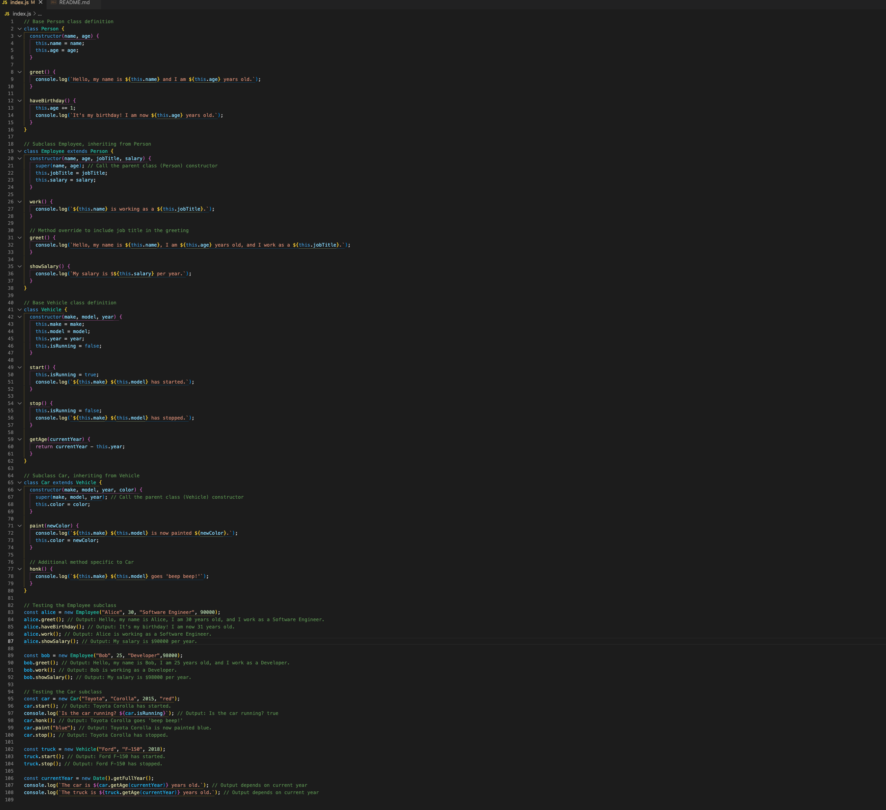

# Introduction to JavaScript Classes with Inheritance



---

## Description 📄

In this lab, we’ll build on our knowledge of basic JavaScript classes and introduce **inheritance**, a key concept in object-oriented programming. **Inheritance** allows a class (subclass) to inherit properties and methods from another class (base class), promoting code reuse and making it easier to create complex relationships between objects.

This lab expands upon the previous JavaScript classes with the following:
- **Person and Employee Classes**: The `Employee` class will inherit from the `Person` class, allowing employees to have common `Person` attributes, as well as additional job-related properties and methods.
- **Vehicle and Car Classes**: The `Car` class will inherit from `Vehicle`, sharing the basic vehicle properties and behaviors while adding specialized methods specific to cars.

By the end of this lab, you will:
- Understand how inheritance works in JavaScript and how it can streamline code organization.
- Learn how to define subclasses that extend the functionality of base classes.
- Be able to create objects from subclasses and demonstrate how they inherit and extend their base class methods and properties.

This advanced lab will reinforce foundational concepts while teaching you how to model more intricate relationships between objects, preparing you for further development in object-oriented JavaScript programming.

## Expected Project Structure 🏗️

Your project should be structured as follows:

```plaintext
javascript-classes-inheritance/
├── index.js
└── README.md
```

##

## Instructions ✅

### 1. **Create the Project Folder and Files**
   - [ ] Create a project folder named javascript-classes-inheritance to store your project files.

   - [ ] Inside the javascript-classes-inheritance folder, create a file named index.js. This will be your main JavaScript file where all your code will be written.

##

### 2. **Build Out Your Person Class**

In this step, you will create a `Person` class to model a person with specific attributes and behaviors. The `Person` class will have properties to store a person’s `name` and `age`, as well as methods to introduce the person and celebrate their birthday. Later, you’ll call this class to create and log different `Person` objects with unique names and ages, demonstrating the reusability of the class to represent various individuals.

- [ ] Add the following code to your `index.js` file:

```javascript
// Person class definition
class Person {
  constructor(name, age) {
    this.name = name;
    this.age = age;
  }

  greet() {
    console.log(`Hello, my name is ${this.name} and I am ${this.age} years old.`);
  }

  haveBirthday() {
    this.age += 1;
    console.log(`It's my birthday! I am now ${this.age} years old.`);
  }
}
```

**Explanation:**

- **Creating the Class Structure:** The `Person` class acts as a template for creating objects that share common properties (`name` and `age`) and methods (`greet` and `haveBirthday`). This structure demonstrates **object-oriented programming (OOP)** in JavaScript, where classes are used to define and organize code based on real-world objects.

- **Constructor Function:** The `constructor(name, age)` is a special function that automatically runs when a new `Person` instance is created. It initializes each `Person` object with specific values for `name` and `age` based on the arguments provided when creating a new instance.

- **`greet` Method:** The `greet` method logs a personalized greeting that includes the `name` and `age` properties. By using **template literals** (`${}` syntax), the greeting dynamically incorporates each instance's unique information, making the `Person` class reusable for various individuals.

- **`haveBirthday` Method:** The `haveBirthday` method increases the `age` by one each time it’s called, simulating a birthday celebration. It also logs a celebratory message with the updated age, showcasing how the class can change an object’s properties over time.

- **Using the Class Later:** After defining the class, we’ll create different `Person` instances and log unique values to the console. Each instance will have its own `name` and `age`, illustrating how this class can represent multiple people with distinct attributes and behaviors.

##

### 3. **Build the Employee Subclass Using Inheritance from the Person Class**

In this step, you will create an `Employee` subclass that inherits from the `Person` class. This subclass will add job-related properties and methods specific to employees, while also inheriting the properties and methods defined in `Person`. Using inheritance in this way makes it easy to extend existing classes with additional functionality, keeping your code organized and reusable.

- [ ] Add the following code to your `index.js` file:

```javascript
// Subclass Employee, inheriting from Person
class Employee extends Person {
  constructor(name, age, jobTitle, salary) {
    super(name, age); // Call the parent class (Person) constructor
    this.jobTitle = jobTitle;
    this.salary = salary;
  }

  work() {
    console.log(`${this.name} is working as a ${this.jobTitle}.`);
  }

  // Method override to include job title in the greeting
  greet() {
    console.log(`Hello, my name is ${this.name}, I am ${this.age} years old, and I work as a ${this.jobTitle}.`);
  }

  showSalary() {
    console.log(`My salary is $${this.salary} per year.`);
  }
}
```

**Explanation:**

- **Inheritance with `extends`:** The `Employee` class uses the `extends` keyword to inherit from `Person`. This means that `Employee` instances automatically have access to all properties (`name` and `age`) and methods (`greet` and `haveBirthday`) defined in the `Person` class, enabling reuse of the base functionality.

- **Constructor with `super()`:** The `constructor(name, age, jobTitle, salary)` function in `Employee` calls `super(name, age)`, which refers to the constructor of `Person`. This initializes the `name` and `age` properties for the `Employee` instance by leveraging `Person`'s constructor, avoiding redundancy.

- **Additional Properties (`jobTitle` and `salary`):** `Employee` introduces additional properties, `jobTitle` and `salary`, that are specific to employee objects. These properties do not exist in the `Person` class, highlighting how inheritance allows for customization in subclasses while maintaining shared functionality from the base class.

- **Method Override (`greet`):** The `greet` method in `Employee` overrides the `greet` method inherited from `Person`. By redefining `greet`, `Employee` provides a customized message that includes the employee’s `jobTitle`. This allows each employee instance to display job-specific information in their greeting, without changing the original `Person` class behavior.

- **New Methods (`work` and `showSalary`):** The `Employee` class introduces two additional methods:
  - **`work`** logs a message describing the employee’s job role.
  - **`showSalary`** displays the employee's salary.
  
  These methods are unique to `Employee`, demonstrating how subclasses can have specialized methods that don’t exist in the base class, enabling specific behaviors for different types of objects.

##

### 4. **Add the Base Vehicle Class**

In this step, you will create a `Vehicle` class that serves as a blueprint for different types of vehicles. This base class will have properties to store the vehicle’s `make`, `model`, `year`, and running state (`isRunning`). Additionally, it will have methods to start, stop, and calculate the vehicle's age. In later steps, you'll extend this class to create specific types of vehicles with additional functionality.

- [ ] Add the following code to your `index.js` file:

```javascript
// Base Vehicle class definition
class Vehicle {
  constructor(make, model, year) {
    this.make = make;
    this.model = model;
    this.year = year;
    this.isRunning = false;
  }

  start() {
    this.isRunning = true;
    console.log(`${this.make} ${this.model} has started.`);
  }

  stop() {
    this.isRunning = false;
    console.log(`${this.make} ${this.model} has stopped.`);
  }

  getAge(currentYear) {
    return currentYear - this.year;
  }
}
```

**Explanation:**

- **Creating the Vehicle Class Structure:** The `Vehicle` class represents general vehicle attributes like `make`, `model`, `year`, and a property, `isRunning`, that tracks whether the vehicle is currently on or off. This class provides a foundation for creating vehicle objects with shared characteristics.

- **Constructor Function:** The `constructor(make, model, year)` initializes each `Vehicle` instance with specific values for `make`, `model`, and `year`, and sets `isRunning` to `false` by default to represent that the vehicle is initially off.

- **`start` Method:** The `start` method changes `isRunning` to `true` and logs a message indicating that the vehicle has started. This simulates the action of turning the vehicle on.

- **`stop` Method:** The `stop` method sets `isRunning` back to `false` and logs a message indicating that the vehicle has stopped, simulating the action of turning off the vehicle.

- **`getAge` Method:** The `getAge` method takes `currentYear` as a parameter and calculates the vehicle’s age by subtracting its `year` from the `currentYear`. This method allows each vehicle instance to report its age based on the current year, demonstrating how the class can provide useful, calculated information about each instance.

- **Using the Class Later:** After defining the `Vehicle` class, we can create various vehicle objects with unique values for `make`, `model`, and `year`. This base class will also serve as a foundation for subclasses, which can inherit and expand upon its functionality in upcoming steps.


##

### 5. **Add the Car Subclass Using Inheritance from the Vehicle Class**

In this step, you will create a `Car` subclass that inherits from the `Vehicle` class. This subclass will add properties and methods specific to cars, while inheriting the general attributes and behaviors from `Vehicle`. Using inheritance here allows the `Car` class to reuse the `Vehicle` class’s methods, such as `start` and `stop`, while adding unique functionality.

- [ ] Add the following code to your `index.js` file:

```javascript
// Subclass Car, inheriting from Vehicle
class Car extends Vehicle {
  constructor(make, model, year, color) {
    super(make, model, year); // Call the parent class (Vehicle) constructor
    this.color = color;
  }

  paint(newColor) {
    console.log(`${this.make} ${this.model} is now painted ${newColor}.`);
    this.color = newColor;
  }

  // Additional method specific to Car
  honk() {
    console.log(`${this.make} ${this.model} goes 'beep beep!'`);
  }
}
```

**Explanation:**

- **Inheritance with `extends`:** The `Car` class uses the `extends` keyword to inherit from `Vehicle`. This allows `Car` instances to have access to all properties (`make`, `model`, `year`, `isRunning`) and methods (`start`, `stop`, `getAge`) defined in `Vehicle`. By inheriting from `Vehicle`, the `Car` class can reuse these common vehicle behaviors without needing to redefine them, making the code more modular and efficient.

- **Constructor with `super()`:** The `constructor(make, model, year, color)` in `Car` calls `super(make, model, year)`, which references the `Vehicle` constructor. This call initializes `make`, `model`, and `year` properties by using `Vehicle`'s setup. The additional `color` property is unique to `Car` and is initialized directly within the `Car` constructor.

- **Additional Property (`color`):** The `color` property is specific to the `Car` class and represents the car's color. This property is not part of the `Vehicle` class, illustrating how subclasses can expand upon their base class with more specialized properties.

- **New Methods (`paint` and `honk`):**
  - **`paint` Method:** The `paint` method changes the `color` property to a new value (`newColor`) and logs a message indicating the updated color. This feature allows each `Car` instance to be repainted dynamically, simulating a real-world behavior for car objects.
  - **`honk` Method:** The `honk` method logs a sound message to simulate a car horn. This behavior is specific to the `Car` class, demonstrating how subclasses can introduce new methods that aren’t part of the base class. This adds unique functionality to `Car` without affecting `Vehicle`.

- **Using the Class Later:** After defining the `Car` class, you can create car objects that inherit basic vehicle properties and methods from `Vehicle`, while also being able to perform car-specific actions like repainting and honking. This setup demonstrates the power of inheritance by allowing both shared and specialized behaviors in different types of objects.


##

### 6. **Start Testing Our Classes**

In this step, we’ll begin testing the `Employee` subclass to ensure that it correctly inherits properties and methods from the `Person` class, while also demonstrating its unique methods and attributes. By creating instances of `Employee`, we can confirm that the inherited methods and additional functionality work as expected.

- [ ] Add the following code to your `index.js` file to test the `Employee` subclass:

```javascript
// Testing the Employee subclass
const alice = new Employee("Alice", 30, "Software Engineer", 90000);
alice.greet();          // Output: Hello, my name is Alice, I am 30 years old, and I work as a Software Engineer.
alice.haveBirthday();   // Output: It's my birthday! I am now 31 years old.
alice.work();           // Output: Alice is working as a Software Engineer.
alice.showSalary();     // Output: My salary is $90000 per year.
```

- [ ] Run your code using Node.js in the terminal to test the `Vehicle` instance:

    ```bash
    node index.js
    ```

### Expected Output:

```bash
Hello, my name is Alice, I am 30 years old, and I work as a Software Engineer.
It's my birthday! I am now 31 years old.
Alice is working as a Software Engineer.
My salary is $90000 per year.
```

**Explanation**

In this step, we tested the `Employee` subclass to verify that it correctly inherited properties and methods from the `Person` class, and that its unique properties and methods were functioning as expected. Here’s a breakdown of what we did:

- **Created an `Employee` Instance:**
  - We created an instance of the `Employee` class named `alice` using the `Employee` constructor, passing values for `name`, `age`, `jobTitle`, and `salary`.
  - This instance initialization used both the properties inherited from `Person` (`name` and `age`) and new properties specific to `Employee` (`jobTitle` and `salary`).

- **Tested the `greet` Method (Overridden):**
  - We called the `greet` method on `alice`.
  - This method was overridden in the `Employee` class to include the `jobTitle` in the greeting message.
  - The output confirmed that `alice.greet()` correctly included her name, age, and job title.

- **Tested the `haveBirthday` Method (Inherited):**
  - We called `alice.haveBirthday()`, which increased `alice`'s `age` by one and logged a birthday message.
  - This method was inherited directly from `Person`, demonstrating that `Employee` instances can use methods defined in the parent class.
  - The output showed that the method worked correctly, updating the age and logging the new age.

- **Tested the `work` Method (Unique to `Employee`):**
  - We called the `work` method on `alice`.
  - This method is unique to `Employee` and logs a message that describes `alice`'s job role.
  - The output verified that `alice.work()` correctly displayed her current job activity.

- **Tested the `showSalary` Method (Unique to `Employee`):**
  - We called `alice.showSalary()` to log `alice`'s salary.
  - This method is also unique to `Employee`, displaying the `salary` property specific to employee instances.
  - The output confirmed that `alice.showSalary()` worked as intended, showing the correct salary amount.

- **Ran the Code to Confirm Expected Output:**
  - After adding the test code to `index.js`, we ran the file using `node index.js` in the terminal.
  - The expected output in the console matched the designed behavior of each method, verifying that both inherited and subclass-specific functionalities are working as intended.

This testing confirmed the functionality of our class inheritance, demonstrating how `Employee` instances inherit methods from `Person` and can introduce specialized methods and properties that are specific to employees.

##

### 7. **Testing Another Employee Instance**

In this step, we’ll test the `Employee` subclass further by creating an additional `Employee` instance. This will help confirm that each `Employee` object can independently represent unique individuals with their own properties, and that both inherited and unique methods function correctly.

- [ ] Add the following code to your `index.js` file to test the new `Employee` instance:

```javascript
// Testing another Employee instance
const bob = new Employee("Bob", 25, "Developer", 98000);
bob.greet();          // Output: Hello, my name is Bob, I am 25 years old, and I work as a Developer.
bob.work();           // Output: Bob is working as a Developer.
bob.showSalary();     // Output: My salary is $98000 per year.
```

- [ ] Run your code using Node.js in the terminal to test the `Vehicle` instance:

    ```bash
    node index.js
    ```

### Expected Output:

```bash
Hello, my name is Bob, I am 25 years old, and I work as a Developer.
Bob is working as a Developer.
My salary is $98000 per year.
```

**Explanation**

In this step, we tested a second `Employee` instance, `bob`, to confirm that each `Employee` object can hold unique properties and utilize both inherited and subclass-specific methods independently. Here’s what was verified:

- **Created a New Employee Instance:**
  - We created a new instance of `Employee` named `bob` with values for `name`, `age`, `jobTitle`, and `salary` that are unique to this instance.
  - This instance was initialized using properties inherited from `Person` (`name` and `age`) as well as properties specific to `Employee` (`jobTitle` and `salary`), confirming that the subclass can accept and use its own unique data.

- **Tested the `greet` Method (Overridden):**
  - We called `bob.greet()`, which is overridden in `Employee` to include the `jobTitle`.
  - This confirmed that the method correctly logs Bob’s name, age, and job title, verifying that the overridden `greet` method functions as expected for individual instances.

- **Tested the `work` Method (Unique to `Employee`):**
  - We called `bob.work()`, a method unique to the `Employee` subclass.
  - The output verified that `bob.work()` correctly logs Bob’s job activity as a Developer, showcasing how `Employee` can introduce behavior not present in `Person`.

- **Tested the `showSalary` Method (Unique to `Employee`):**
  - We called `bob.showSalary()` to display Bob’s salary.
  - This method, specific to `Employee`, confirmed that the `salary` property functions independently in each instance.
  - The output confirmed that `bob.showSalary()` displayed the correct salary set for Bob.

- **Ran the Code to Confirm Expected Output:**
  - After adding the new test code, we ran `node index.js` in the terminal.
  - The console output matched the expected behavior of each method, validating that each `Employee` instance can hold unique properties and operate independently.


##

### 8. **Testing the Car Subclass**

In this step, we’ll test the `Car` subclass to confirm that it correctly inherits properties and methods from the `Vehicle` class while demonstrating its unique methods and attributes. By creating an instance of `Car`, we can verify that both the inherited and subclass-specific methods work as expected.

- [ ] Add the following code to your `index.js` file to test the `Car` subclass:

```javascript
// Testing the Car subclass
const car = new Car("Toyota", "Corolla", 2015, "red");
car.start();                                  // Output: Toyota Corolla has started.
console.log(`Is the car running? ${car.isRunning}`); // Output: Is the car running? true
car.honk();                                   // Output: Toyota Corolla goes 'beep beep!'
car.paint("blue");                            // Output: Toyota Corolla is now painted blue.
car.stop();                                   // Output: Toyota Corolla has stopped.
```

- [ ] Run your code using Node.js in the terminal to test the `Vehicle` instance:

    ```bash
    node index.js
    ```

### Expected Output:

```bash
Toyota Corolla has started.
Is the car running? true
Toyota Corolla goes 'beep beep!'
Toyota Corolla is now painted blue.
Toyota Corolla has stopped.
```

**Explanation**

In this step, we tested the `Car` subclass to ensure it correctly inherits from the `Vehicle` class and performs both inherited and subclass-specific operations. Here’s a breakdown of what we confirmed:

- **Created a Car Instance:**
  - We created a new instance of `Car` named `car` with specific values for `make`, `model`, `year`, and `color`.
  - This initialization used inherited properties from `Vehicle` (`make`, `model`, `year`, `isRunning`) along with the `color` property unique to `Car`.

- **Tested the `start` Method (Inherited):**
  - We called `car.start()` to set `isRunning` to `true` and log a message that the car has started.
  - This method, inherited from `Vehicle`, verified that `Car` can use starting functionality defined in its parent class.

- **Checked `isRunning` Property (Inherited):**
  - We logged the `isRunning` property to check the car’s running state after calling `start`.
  - This showed that `Car` correctly inherited the `isRunning` property from `Vehicle` and maintained its state.

- **Tested the `honk` Method (Unique to Car):**
  - We called `car.honk()`, which logs a sound message to simulate the car horn.
  - This method is unique to `Car`, demonstrating how subclasses can add custom methods beyond those in the base class.

- **Tested the `paint` Method (Unique to Car):**
  - We called `car.paint("blue")` to change the `color` property and log a message reflecting the new color.
  - This confirmed that `Car` instances can dynamically update their `color`, showcasing the subclass-specific functionality.

- **Tested the `stop` Method (Inherited):**
  - We called `car.stop()` to set `isRunning` to `false` and log a message indicating that the car has stopped.
  - This method, inherited from `Vehicle`, confirmed that `Car` retains the ability to stop, as provided by the base class.

- **Ran the Code to Confirm Expected Output:**
  - After adding the test code, we ran `node index.js` in the terminal.
  - The console output matched the expected results for each method, verifying that `Car` can use both inherited methods from `Vehicle` and its own unique methods independently.


##

### 9. **Testing the Vehicle Class**

In this step, we’ll test the `Vehicle` class directly by creating an instance of `Vehicle` called `truck`. This will confirm that `Vehicle` instances can be created independently and that they function correctly with their own methods. Since `Vehicle` is the base class, we won’t have any subclass-specific methods, allowing us to focus solely on the inherited functionality.

- [ ] Add the following code to your `index.js` file to test the `Vehicle` class:

```javascript
// Testing the Vehicle class
const truck = new Vehicle("Ford", "F-150", 2018);
truck.start();   // Output: Ford F-150 has started.
truck.stop();    // Output: Ford F-150 has stopped.
```

- [ ] Run your code using Node.js in the terminal to test the `Vehicle` instance:

    ```bash
    node index.js
    ```

### Expected Output:

```bash
Ford F-150 has started.
Ford F-150 has stopped.
```

**Explanation**

In this step, we created and tested an instance of the `Vehicle` class, named `truck`, to confirm that the class functions correctly with its own properties and methods, independent of any subclasses. Here’s a breakdown of the verification:

- **Created a Vehicle Instance:**
  - We instantiated a `Vehicle` object called `truck` with the properties `make`, `model`, and `year`.
  - This initialization confirmed that `Vehicle` can represent general vehicle data without needing subclass-specific properties or methods.

- **Tested the `start` Method:**
  - Calling `truck.start()` set the `isRunning` property to `true` and logged a message stating that the vehicle has started.
  - This output verified that the `start` method functions correctly for instances of `Vehicle`, showing that `truck` can be set to a running state.

- **Tested the `stop` Method:**
  - We then called `truck.stop()`, which set `isRunning` to `false` and logged a message indicating that the vehicle has stopped.
  - This confirmed that the `stop` method works as expected, toggling the `isRunning` state back to `false` and logging the appropriate message for a non-running state.

- **Ran the Code to Confirm Expected Output:**
  - After adding this test code, we ran the file with `node index.js` in the terminal.
  - The console output matched the expected results for both the `start` and `stop` methods, verifying that `Vehicle` instances function as designed, providing foundational functionality that can be shared by subclasses like `Car`.

This test validated that `Vehicle` operates correctly as a standalone class, supporting core behaviors essential for managing the state of any vehicle object.


##

### 10. **Final Testing: Calculating Vehicle Age**

In this final step, we’ll test the `getAge` method for both `Car` and `Vehicle` instances. This method calculates the age of the vehicle based on the current year, verifying that each instance can use inherited methods to perform calculations specific to its properties.

- [ ] Add the following code to your `index.js` file to test the `getAge` method for both `car` and `truck`:

```javascript
// Final testing of the getAge method for both car and truck
const currentYear = new Date().getFullYear();
console.log(`The car is ${car.getAge(currentYear)} years old.`);   // Output depends on current year
console.log(`The truck is ${truck.getAge(currentYear)} years old.`); // Output depends on current year
```

- [ ] Run your code using Node.js in the terminal to test the `Vehicle` instance:

    ```bash
    node index.js
    ```

### Expected Output:

The output will vary depending on the current year, as it dynamically calculates the age of each vehicle based on the year property:
```bash
The car is X years old.
The truck is Y years old.
```

**Explanation of Step 10: Final Testing of the `getAge` Method**

In this step, we tested the `getAge` method for both `Car` and `Vehicle` instances to confirm that it accurately calculates the age of each vehicle based on the current year. Here’s what we verified:

- **Calculated Age for Car Instance:**
  - We called `car.getAge(currentYear)`, which used the `year` property of the `Car` instance to calculate the car’s age.
  - This verified that `Car` correctly inherited the `getAge` method from `Vehicle`, allowing it to use the `year` of the car and the current year to calculate the car’s age.

- **Calculated Age for Vehicle Instance (Truck):**
  - We called `truck.getAge(currentYear)`, which used the `year` property of the `Vehicle` instance (the truck) to calculate its age.
  - This confirmed that instances of the `Vehicle` class can directly use the `getAge` method, proving that it functions as expected for objects created from the `Vehicle` base class.

- **Ran the Code to Confirm Expected Output:**
  - After adding the final test code, we ran the file using `node index.js` in the terminal.
  - The console output displayed the correct age of each vehicle based on the current year, confirming that `getAge` is working correctly for both `Car` and `Vehicle` instances.

This final test demonstrated that the `getAge` method is effective across both the base class (`Vehicle`) and subclass (`Car`), accurately calculating and logging each vehicle's age based on its `year` property and the current year.

##

### 11. **Commit and Push to GitHub**

In this final step, you’ll commit your changes and push your project to GitHub to save and share your work. This will ensure that your project is versioned and backed up remotely.

- [ ] **Initialize Git (if not already initialized):**
     ```bash
     git init
     ```

- [ ] **Add All Changes to Staging:**
     ```bash
     git add .
     ```

- [ ] **Commit Your Changes:**
     ```bash
     git commit -m "Add JavaScript classes with inheritance and final testing"
     ```

- [ ] **Connect to Your GitHub Repository** (if not already connected):
     - Replace `<username>` with your GitHub username and `<repository-name>` with the name of your repository.
     ```bash
     git remote add origin https://github.com/<username>/<repository-name>.git
     ```

- [ ] **Push to GitHub:**
     ```bash
     git push -u origin main
     ```

### Explanation of Step 11: Commit and Push to GitHub

In this step, we committed our changes and pushed the project to GitHub to create a backup and enable version control:

- **Initialized Git:** We ran `git init` to start version control in the project folder if it wasn’t already initialized.
- **Added Changes to Staging:** The `git add .` command staged all project files for the commit.
- **Committed the Changes:** We used `git commit` with a descriptive message to save our work.
- **Connected to GitHub:** We linked our local repository to a GitHub repository using `git remote add origin`.
- **Pushed to GitHub:** Finally, `git push -u origin main` uploaded our code to the `main` branch on GitHub.

This step ensures that your project is versioned and safely stored in GitHub, enabling easy sharing and tracking of changes.


##

## Conclusion 📄

In this lab, you learned how to use **JavaScript classes with inheritance** to create structured, reusable code that models complex, real-world relationships between objects with shared and unique properties and methods. By following each step, you gained practical experience with:

- Defining **base classes** and using **constructors** to initialize objects with predefined values.
- Creating **subclasses** with inheritance to extend base classes, reusing core properties and methods while adding unique functionality.
- Implementing and calling **class methods** to modify and retrieve object properties, using both inherited and subclass-specific methods.
- Creating multiple instances of classes like `Employee` and `Car`, each maintaining independent properties, behaviors, and states.

### Key Takeaways:
- **Object-Oriented Design with Inheritance:** Inheritance allows you to build hierarchical relationships between classes, enhancing code reuse and organization. By defining shared properties in base classes, subclasses can be extended with unique features without duplicating code.
- **Method Overriding and Unique Behaviors:** Methods like `greet`, `work`, and `paint` showcase how subclasses can override and extend base class functionality, allowing instances to respond with specific, tailored behaviors.
- **Flexible Calculations with Parameters:** Using methods like `getAge(currentYear)` illustrates how class methods can interact with both internal properties and external parameters, making your code responsive to real-time data and calculations.

With these skills, you’re now equipped to use **JavaScript classes with inheritance** to build organized, scalable applications that effectively represent relationships between different types of objects. Continue practicing by creating more complex classes and exploring how inheritance enhances code readability, maintainability, and scalability!

### Solution codebase 👀
🛑 **Only use this as a reference** 🛑

💾 **Not something to copy and paste** 💾

**Note:**  This lab references a solution file located [here](https://github.com/HackerUSA-CE/aisd-ajs-03-basic-classes/tree/solution) (link not shown).

---
© All rights reserved to ThriveDX